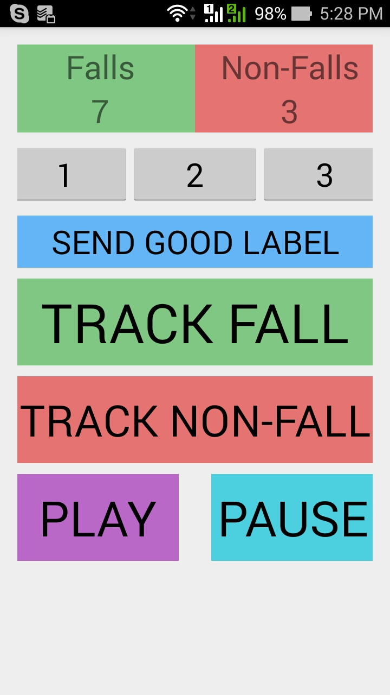
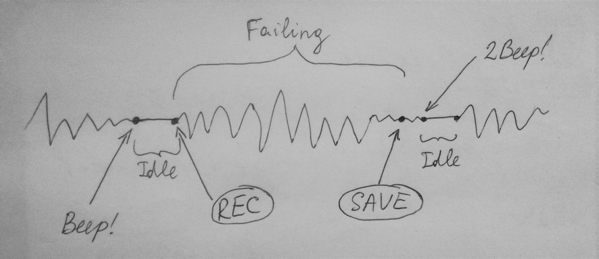

## Sleet Monitor Data
Sleet Monitor Data - это мобильное приложение, задачей которого является сбор тренировочных и тестовых данных для построения и тестирования алгоритма детектирования падений человека на скользкой поверхности.

## Как выглядят данные?
Данные - это показания акселерометра по трем осям с минимально возможным для конкретного устройства SENSOR_DELAY (задержка прихода новых данных). Данные акселерометра пишутся в файл `Download\SleetMonitorData\data.txt` на флеш-карте устройства (если таковой нет, то во внутреннем хранилище). Данные представляют из себя строки вида `time: x_value y_value _z_value ... time: x_value y_value _z_value is_fall`. *time* - время в миллисекундах с момента начала записи состояния, *x_value*, *y_value*, *z_value* - показания акселерометра по соответствующим осям, нормированные по максимально возможному для конкретного типа акселерометра значению. *is_fall* - значение `true`, если запись соответствует паденю, `false` - нет. Строка может иметь разную длину на разных устройствах в зависимости от минимального SENSOR_DELAY на нем, но она всегда ограничена по времени измерения 1.5 сек. Таким образом, если взять устройство Nexus 5, у которого минимальный SENSOR_DELAY акселерометра равен 5 мсек, то за 1.5 секунды мы получим 300 показаний по трем осям (итого 900 значений для одного измерения). Вообще такая частота прихода новых данных очень благоприятна, так как близка к минимально возможной на всех Android устройствах (а может она и есть минимальная среди всех устройств). Исходя из этого, сбор данных будет производиться на Nexus 5, хотя может быть сделан и на любом другом девайсе.

## Как собирать данные с помощью приложения?
Сначала скриншот основного экрана.

.

После запуска приложения можно выбрать режим записи - либо записывается падение (кнопка `TRACK FALL`), либо непадение (`TRACK NON-FALL`). Чтобы начать запись, нужно нажать на кнопку `PLAY`. Система отслеживания движений включится. Весь цикл работы системы изображен на следующем рисунке.

Рассмотрим процесс записи падения. После нажатия на кнопку `PLAY` система ждет, когда колевания смартфона станут незначительными - человек держит телефон в руке, либо кладет его в карман перед началом записи. Как только колебания стали незначительными, система понимает, что человек готов к записи, и она тоже готова - издает коротки звук Beep. Дальше идет состояние *Idle* (безделие), которое длится до тех пор, пока человек не начнет двигаться, либо не начнет колебать смартфон в руке. Тогда система начинает записывать данные (на рисунке эта стадия называется *Failing*). Запись происходит на протяжении 1.5 секунд и завершается длинным сигналом Beep (система записала данные в файл). Пока человек лежит, он не двигается (опять стадия *Idle*). Как только человек начал двигаться, а вместе с ним и смартфон в кармане, система понимает, что человек поднимается. С этого момента цикл повторяется. Для записи непадения все работает точно так же.

Для переключения на другой режим записи нужно просто нажать на соответствующую кнопку. Но перед этим рекомендуется нажать на кнопку `PAUSE`, которая остановит жизненный цикл трекера и отбросит его в начало, а также запретит запись данных до тех пор, пока не будет нажата кнопка `PLAY`. Вообще кнопка `PAUSE` может использоваться всегда, когда человек считает, что сейчас пишутся некорректные данные (не соответствуют режиму записи). Предусмотрена также система избавления от некорректных данных - кнопки `1`, `2`, `3` предназначены для добавления в конец файла метки `Label1`, `Label2`, `Label3`, сигнализирующих о том, что последние измерения 1, 2 или 3 соответственно некорректны. В дальнейшем исследователь удалит эти данные. Также существует отдельная метка `GOOD`, которую человек может поставить, чтобы сказать, что все предыдущие измерения гарантированно корректны.
Еще на экране имеются поля `Falls` и `Non-Falls`, соответствующие кол-ву записанных измерений в данной сессии приложения. При новом запуске приложения система запишет в файл строчку `DataWriter was initialized`, которая позволит исследователю увидеть новую сессию приложения и в случае ошибок в данных сузить область поиска для их удаления.
